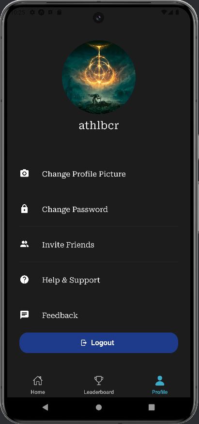

# 🧠 Mind Challenge

A mobile quiz application where users can participate in quizzes across various categories, compete on leaderboards, and earn rewards. The app is built using React Native for the frontend, .NET Core for the backend, and PostgreSQL for the database.

## ✨ Features

- 🎯 **Category-based Quizzes**: Users can choose from a variety of categories and participate in quizzes that match their interests.
- 🔄 **Multiple Difficulty Levels**: Each category includes questions at easy, medium, and hard difficulty levels.
- 🏆 **Leaderboards**: Compete against other users and track your ranking in each category.
- ⏳ **Time Limitations & Bonuses**: Quizzes are timed, and users can earn bonuses for quick and accurate answers.
- 🃏 **Jokers**: Special tools to help users answer difficult questions.
- 👤 **User Profile Management**: Users can update their profile, including changing their avatar and personal details.
- 🏅 **Awards & Badges**: Earn achievements for completing quizzes and reaching milestones.
- 🔐 **Authentication**: Secure user registration and login system with JWT tokens.

## 🛠️ Technology Stack

- 🖼️ **Frontend**: [React Native](https://reactnative.dev/) with [React Native Paper](https://callstack.github.io/react-native-paper/) for UI components.
- 🌐 **Backend**: [ASP.NET Core](https://docs.microsoft.com/en-us/aspnet/core/?view=aspnetcore-6.0) with JWT-based authentication.
- 🗃️ **Database**: [PostgreSQL](https://www.postgresql.org/) for storing user data, quiz questions, and leaderboard information.

## 🚀 Installation

### Prerequisites

- 🟢 Node.js and npm
- 🟣 .NET Core SDK
- 🟡 PostgreSQL

## 🖼️ Screenshots

  

    
    
<b>Home Screen</b>

  

  

    
    
<b>Category Selection</b>

  

  

    
    
<b>Quiz Screen</b>

  

  

    
    
<b>Leaderboard</b>

  

  

    
    
<b>Profile Management</b>

  

  

    
    
<b>Rewards & Badges</b>

  

## 🤝 Contributing

Contributions are welcome! Please follow these steps:

1. Fork the repository.
2. Create a new branch (`git checkout -b feature/your-feature`).
3. Commit your changes (`git commit -am 'Add new feature'`).
4. Push to the branch (`git push origin feature/your-feature`).
5. Create a new Pull Request.

## 📜 License

This project is licensed under the MIT License - see the [LICENSE](LICENSE) file for details.

## 📧 Contact

For any inquiries, please contact Ahmet Talha Biçer at [a.thlbcr@gmail.com](a.thlbcr@gmail.com).
